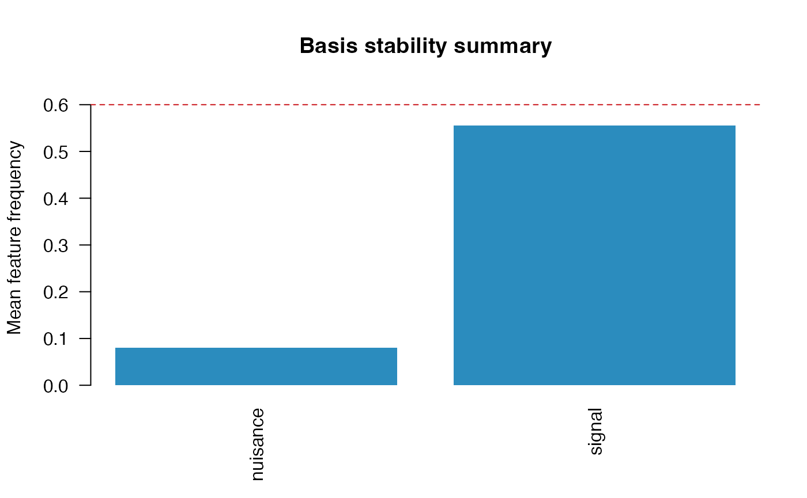

# Basis and FPCA Workflows

`SelectBoost.FDA` can fit spline-basis and FPCA preprocessing directly
from raw curves, store the fitted transforms, and then reuse the same
design/selection machinery as before.

## Fit preprocessing from raw curves

``` r
library(SelectBoost.FDA)
data("motion_example", package = "SelectBoost.FDA")

predictors <- list(
  signal = fda_grid(
    motion_example$predictors$signal,
    argvals = motion_example$grid,
    name = "signal",
    unit = "time"
  ),
  nuisance = fda_grid(
    motion_example$predictors$nuisance,
    argvals = motion_example$grid,
    name = "nuisance",
    unit = "time"
  )
)

prep <- fit_fda_preprocessor(
  predictors = predictors,
  scalar_covariates = motion_example$scalar_covariates,
  transforms = list(
    signal = fda_fpca(n_components = 3),
    nuisance = fda_bspline(df = 5, center = TRUE)
  ),
  scalar_transform = fda_standardize()
)

prep
#> FDA preprocessor
#>   functional predictors: 2 
#>   scalar covariates: 2 
#>   total blocks: 4
summary(prep)
#> FDA preprocessor summary
#>   predictors: 4 
#>  predictor representation   transform n_features
#>     signal          basis        fpca          3
#>   nuisance          basis     bspline          5
#>        age         scalar standardize          1
#>  treatment         scalar standardize          1
```

## Build a design with the fitted preprocessor

``` r
design <- fda_design(
  response = motion_example$response,
  predictors = predictors,
  scalar_covariates = motion_example$scalar_covariates,
  preprocessor = prep,
  family = "gaussian"
)

head(selection_map(design))
#>                feature predictor    block position argval representation
#> signal.1    signal_PC1    signal   signal        1    PC1          basis
#> signal.2    signal_PC2    signal   signal        2    PC2          basis
#> signal.3    signal_PC3    signal   signal        3    PC3          basis
#> nuisance.1 nuisance_B1  nuisance nuisance        1     B1          basis
#> nuisance.2 nuisance_B2  nuisance nuisance        2     B2          basis
#> nuisance.3 nuisance_B3  nuisance nuisance        3     B3          basis
#>            basis_type transform source_predictor source_representation
#> signal.1         fpca      fpca           signal                  grid
#> signal.2         fpca      fpca           signal                  grid
#> signal.3         fpca      fpca           signal                  grid
#> nuisance.1     spline   bspline         nuisance                  grid
#> nuisance.2     spline   bspline         nuisance                  grid
#> nuisance.3     spline   bspline         nuisance                  grid
#>            source_position_start source_position_end source_argval_start
#> signal.1                       1                  30                   0
#> signal.2                       1                  30                   0
#> signal.3                       1                  30                   0
#> nuisance.1                     1                  15                   0
#> nuisance.2                     2                  29  0.0344827586206897
#> nuisance.3                     2                  29  0.0344827586206897
#>            source_argval_end       domain_start        domain_end component
#> signal.1                   1                  0                 1       PC1
#> signal.2                   1                  0                 1       PC2
#> signal.3                   1                  0                 1       PC3
#> nuisance.1 0.482758620689655                  0 0.482758620689655        B1
#> nuisance.2  0.96551724137931 0.0344827586206897  0.96551724137931        B2
#> nuisance.3  0.96551724137931 0.0344827586206897  0.96551724137931        B3
#>            unit feature_index basis_component
#> signal.1   time             1             PC1
#> signal.2   time             2             PC2
#> signal.3   time             3             PC3
#> nuisance.1 time             4              B1
#> nuisance.2 time             5              B2
#> nuisance.3 time             6              B3
#>                                          domain_label
#> signal.1                                   0 - 1 time
#> signal.2                                   0 - 1 time
#> signal.3                                   0 - 1 time
#> nuisance.1                 0 - 0.482758620689655 time
#> nuisance.2 0.0344827586206897 - 0.96551724137931 time
#> nuisance.3 0.0344827586206897 - 0.96551724137931 time
selection_map(design, level = "basis")
#>                 predictor representation basis_type source_representation
#> nuisance.spline  nuisance          basis     spline                  grid
#> signal.fpca        signal          basis       fpca                  grid
#>                 n_components first_component last_component         components
#> nuisance.spline            5              B1             B5 B1, B2, B3, B4, B5
#> signal.fpca                3             PC1            PC3      PC1, PC2, PC3
#>                 domain_start domain_end
#> nuisance.spline            0          1
#> signal.fpca                0          1
```

## Fit grouped stability selection

``` r
fit <- fit_stability(
  design,
  selector = "glmnet",
  B = 30,
  sample_fraction = 0.5,
  cutoff = 0.6,
  seed = 7
)

fit
#> FDA stability selection
#>   family: gaussian 
#>   features: 10 
#>   groups: 4 
#>   replicates: 30 
#>   cutoff: 0.6
summary(fit)
#> FDA stability selection summary
#>   family: gaussian 
#>   predictors: 4 
#>   features: 10 
#>   groups: 4 
#>   replicates: 30 
#>   sample fraction: 0.5 
#>   cutoff: 0.6 
#>   selected features: 3 
#>   selected groups: 3
selection_map(fit)
#>                feature predictor     block position    argval representation
#> signal.1    signal_PC1    signal    signal        1       PC1          basis
#> signal.2    signal_PC2    signal    signal        2       PC2          basis
#> signal.3    signal_PC3    signal    signal        3       PC3          basis
#> nuisance.1 nuisance_B1  nuisance  nuisance        1        B1          basis
#> nuisance.2 nuisance_B2  nuisance  nuisance        2        B2          basis
#> nuisance.3 nuisance_B3  nuisance  nuisance        3        B3          basis
#> nuisance.4 nuisance_B4  nuisance  nuisance        4        B4          basis
#> nuisance.5 nuisance_B5  nuisance  nuisance        5        B5          basis
#> age                age       age       age        1       age         scalar
#> treatment    treatment treatment treatment        1 treatment         scalar
#>            basis_type   transform source_predictor source_representation
#> signal.1         fpca        fpca           signal                  grid
#> signal.2         fpca        fpca           signal                  grid
#> signal.3         fpca        fpca           signal                  grid
#> nuisance.1     spline     bspline         nuisance                  grid
#> nuisance.2     spline     bspline         nuisance                  grid
#> nuisance.3     spline     bspline         nuisance                  grid
#> nuisance.4     spline     bspline         nuisance                  grid
#> nuisance.5     spline     bspline         nuisance                  grid
#> age              <NA> standardize              age                scalar
#> treatment        <NA> standardize        treatment                scalar
#>            source_position_start source_position_end source_argval_start
#> signal.1                       1                  30                   0
#> signal.2                       1                  30                   0
#> signal.3                       1                  30                   0
#> nuisance.1                     1                  15                   0
#> nuisance.2                     2                  29  0.0344827586206897
#> nuisance.3                     2                  29  0.0344827586206897
#> nuisance.4                     2                  29  0.0344827586206897
#> nuisance.5                    16                  30   0.517241379310345
#> age                            1                   1                 age
#> treatment                      1                   1           treatment
#>            source_argval_end       domain_start        domain_end component
#> signal.1                   1                  0                 1       PC1
#> signal.2                   1                  0                 1       PC2
#> signal.3                   1                  0                 1       PC3
#> nuisance.1 0.482758620689655                  0 0.482758620689655        B1
#> nuisance.2  0.96551724137931 0.0344827586206897  0.96551724137931        B2
#> nuisance.3  0.96551724137931 0.0344827586206897  0.96551724137931        B3
#> nuisance.4  0.96551724137931 0.0344827586206897  0.96551724137931        B4
#> nuisance.5                 1  0.517241379310345                 1        B5
#> age                      age                age               age      <NA>
#> treatment          treatment          treatment         treatment      <NA>
#>            unit feature_index basis_component
#> signal.1   time             1             PC1
#> signal.2   time             2             PC2
#> signal.3   time             3             PC3
#> nuisance.1 time             4              B1
#> nuisance.2 time             5              B2
#> nuisance.3 time             6              B3
#> nuisance.4 time             7              B4
#> nuisance.5 time             8              B5
#> age        <NA>             9            <NA>
#> treatment  <NA>            10            <NA>
#>                                          domain_label feature_frequency
#> signal.1                                   0 - 1 time        1.00000000
#> signal.2                                   0 - 1 time        0.33333333
#> signal.3                                   0 - 1 time        0.33333333
#> nuisance.1                 0 - 0.482758620689655 time        0.13333333
#> nuisance.2 0.0344827586206897 - 0.96551724137931 time        0.03333333
#> nuisance.3 0.0344827586206897 - 0.96551724137931 time        0.00000000
#> nuisance.4 0.0344827586206897 - 0.96551724137931 time        0.10000000
#> nuisance.5                 0.517241379310345 - 1 time        0.13333333
#> age                                               age        0.80000000
#> treatment                                   treatment        0.70000000
#>            selected group_id     group group_frequency group_selected
#> signal.1       TRUE        1    signal       1.0000000           TRUE
#> signal.2      FALSE        1    signal       1.0000000           TRUE
#> signal.3      FALSE        1    signal       1.0000000           TRUE
#> nuisance.1    FALSE        2  nuisance       0.2666667          FALSE
#> nuisance.2    FALSE        2  nuisance       0.2666667          FALSE
#> nuisance.3    FALSE        2  nuisance       0.2666667          FALSE
#> nuisance.4    FALSE        2  nuisance       0.2666667          FALSE
#> nuisance.5    FALSE        2  nuisance       0.2666667          FALSE
#> age            TRUE        3       age       0.8000000           TRUE
#> treatment      TRUE        4 treatment       0.7000000           TRUE
selection_map(fit, level = "basis")
#>                 predictor representation basis_type source_representation
#> nuisance.spline  nuisance          basis     spline                  grid
#> signal.fpca        signal          basis       fpca                  grid
#>                 n_components first_component last_component         components
#> nuisance.spline            5              B1             B5 B1, B2, B3, B4, B5
#> signal.fpca                3             PC1            PC3      PC1, PC2, PC3
#>                 domain_start domain_end mean_feature_frequency
#> nuisance.spline            0          1              0.0800000
#> signal.fpca                0          1              0.5555556
#>                 max_feature_frequency selected_components
#> nuisance.spline             0.1333333                   0
#> signal.fpca                 1.0000000                   1
selected(fit, level = "basis")
#>             predictor representation basis_type source_representation
#> signal.fpca    signal          basis       fpca                  grid
#>             n_components first_component last_component    components
#> signal.fpca            3             PC1            PC3 PC1, PC2, PC3
#>             domain_start domain_end mean_feature_frequency
#> signal.fpca            0          1              0.5555556
#>             max_feature_frequency selected_components
#> signal.fpca                     1                   1
plot(fit, type = "basis", value = "mean")
```



The basis-level summary is often the most convenient table for
reporting:

- `n_components` counts the basis coefficients or FPCA scores in each
  predictor.
- `selected_components` reports how many exceed the stability threshold.
- `mean_feature_frequency` and `max_feature_frequency` summarize
  component-wise stability within each basis-expanded predictor.

## Interpretation note

For FPCA in particular, scores are often much less correlated than dense
raw grid points. In that setting, grouped stability selection is usually
the more natural default, while `SelectBoost` remains most useful for
dense discretizations or strongly correlated basis systems.
