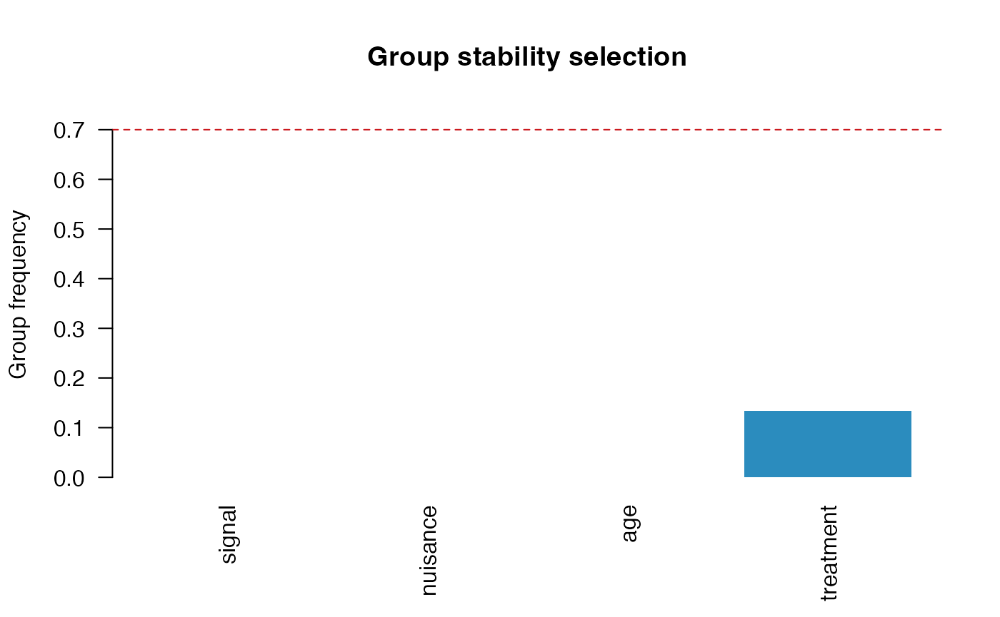
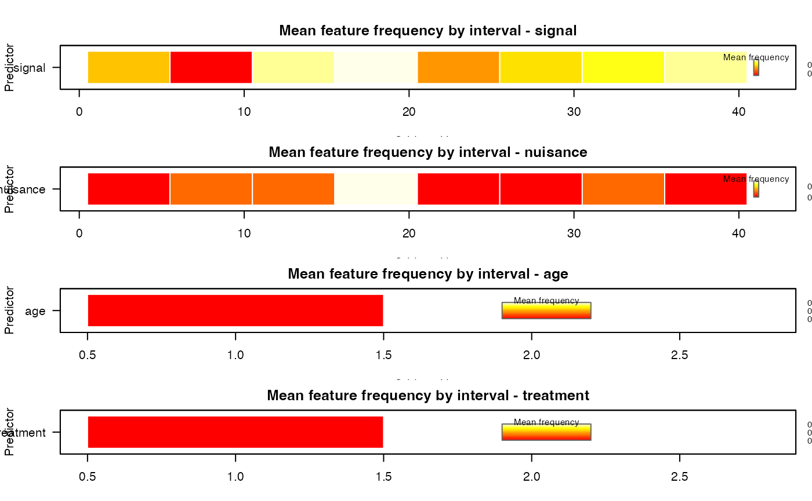

# Discretized Curves and Grouped Stability Selection

`SelectBoost.FDA` can now go from raw discretized curves to stability
summaries without any manual matrix construction. The design object
stores the fitted preprocessing, the flattened matrix used by the
selector, and the reversible map back to the original curve domain.

## Build a functional design

``` r

library(SelectBoost.FDA)
data("spectra_example", package = "SelectBoost.FDA")

signal <- fda_grid(
  spectra_example$predictors$signal,
  argvals = spectra_example$grid,
  name = "signal",
  unit = "nm"
)
nuisance <- fda_grid(
  spectra_example$predictors$nuisance,
  argvals = spectra_example$grid,
  name = "nuisance",
  unit = "nm"
)

design <- fda_design(
  response = spectra_example$response,
  predictors = list(signal = signal, nuisance = nuisance),
  scalar_covariates = spectra_example$scalar_covariates,
  scalar_transform = fda_standardize(),
  family = "gaussian"
)

design
#> FDA design
#>   observations: 80 
#>   features: 82 
#>   functional predictors: 2 
#>   scalar covariates: 2 
#>   family: gaussian 
#>   response available: TRUE
summary(design)
#> FDA design summary
#>   observations: 80 
#>   features: 82 
#>   family: gaussian 
#>   response available: TRUE 
#>   functional predictors: 2 
#>   scalar covariates: 2 
#>  predictor representation n_features
#>   nuisance           grid         40
#>     signal           grid         40
#>        age         scalar          1
#>  treatment         scalar          1
head(selection_map(design))
#>           feature predictor  block position           argval representation
#> signal.1 signal_1    signal signal        1             1100           grid
#> signal.2 signal_2    signal signal        2 1135.89743589744           grid
#> signal.3 signal_3    signal signal        3 1171.79487179487           grid
#> signal.4 signal_4    signal signal        4 1207.69230769231           grid
#> signal.5 signal_5    signal signal        5 1243.58974358974           grid
#> signal.6 signal_6    signal signal        6 1279.48717948718           grid
#>          basis_type transform source_predictor source_representation
#> signal.1       <NA>  identity           signal                  grid
#> signal.2       <NA>  identity           signal                  grid
#> signal.3       <NA>  identity           signal                  grid
#> signal.4       <NA>  identity           signal                  grid
#> signal.5       <NA>  identity           signal                  grid
#> signal.6       <NA>  identity           signal                  grid
#>          source_position_start source_position_end source_argval_start
#> signal.1                     1                   1                1100
#> signal.2                     2                   2    1135.89743589744
#> signal.3                     3                   3    1171.79487179487
#> signal.4                     4                   4    1207.69230769231
#> signal.5                     5                   5    1243.58974358974
#> signal.6                     6                   6    1279.48717948718
#>          source_argval_end     domain_start       domain_end component unit
#> signal.1              1100             1100             1100      <NA>   nm
#> signal.2  1135.89743589744 1135.89743589744 1135.89743589744      <NA>   nm
#> signal.3  1171.79487179487 1171.79487179487 1171.79487179487      <NA>   nm
#> signal.4  1207.69230769231 1207.69230769231 1207.69230769231      <NA>   nm
#> signal.5  1243.58974358974 1243.58974358974 1243.58974358974      <NA>   nm
#> signal.6  1279.48717948718 1279.48717948718 1279.48717948718      <NA>   nm
#>          feature_index basis_component        domain_label
#> signal.1             1            <NA>             1100 nm
#> signal.2             2            <NA> 1135.89743589744 nm
#> signal.3             3            <NA> 1171.79487179487 nm
#> signal.4             4            <NA> 1207.69230769231 nm
#> signal.5             5            <NA> 1243.58974358974 nm
#> signal.6             6            <NA> 1279.48717948718 nm
```

The design stores the fitted preprocessing object as well. In this first
workflow the functional predictors stay on their original grid, while
the scalar covariates are standardized.

``` r

design$preprocessor
#> FDA preprocessor
#>   functional predictors: 2 
#>   scalar covariates: 2 
#>   total blocks: 4
summary(design$preprocessor)
#> FDA preprocessor summary
#>   predictors: 4 
#>  predictor representation   transform n_features
#>     signal           grid    identity         40
#>   nuisance           grid    identity         40
#>        age         scalar standardize          1
#>  treatment         scalar standardize          1
```

## Fit grouped stability selection

The following chunk is evaluated only when `grpreg` is installed.

``` r

fit <- fit_stability(
  design,
  selector = "grpreg",
  B = 30,
  sample_fraction = 0.5,
  cutoff = 0.7,
  seed = 1
)

fit
#> FDA stability selection
#>   family: gaussian 
#>   features: 82 
#>   groups: 4 
#>   replicates: 30 
#>   cutoff: 0.7
summary(fit)
#> FDA stability selection summary
#>   family: gaussian 
#>   predictors: 4 
#>   features: 82 
#>   groups: 4 
#>   replicates: 30 
#>   sample fraction: 0.5 
#>   cutoff: 0.7 
#>   selected features: 0 
#>   selected groups: 0
head(selection_map(fit))
#>           feature predictor  block position           argval representation
#> signal.1 signal_1    signal signal        1             1100           grid
#> signal.2 signal_2    signal signal        2 1135.89743589744           grid
#> signal.3 signal_3    signal signal        3 1171.79487179487           grid
#> signal.4 signal_4    signal signal        4 1207.69230769231           grid
#> signal.5 signal_5    signal signal        5 1243.58974358974           grid
#> signal.6 signal_6    signal signal        6 1279.48717948718           grid
#>          basis_type transform source_predictor source_representation
#> signal.1       <NA>  identity           signal                  grid
#> signal.2       <NA>  identity           signal                  grid
#> signal.3       <NA>  identity           signal                  grid
#> signal.4       <NA>  identity           signal                  grid
#> signal.5       <NA>  identity           signal                  grid
#> signal.6       <NA>  identity           signal                  grid
#>          source_position_start source_position_end source_argval_start
#> signal.1                     1                   1                1100
#> signal.2                     2                   2    1135.89743589744
#> signal.3                     3                   3    1171.79487179487
#> signal.4                     4                   4    1207.69230769231
#> signal.5                     5                   5    1243.58974358974
#> signal.6                     6                   6    1279.48717948718
#>          source_argval_end     domain_start       domain_end component unit
#> signal.1              1100             1100             1100      <NA>   nm
#> signal.2  1135.89743589744 1135.89743589744 1135.89743589744      <NA>   nm
#> signal.3  1171.79487179487 1171.79487179487 1171.79487179487      <NA>   nm
#> signal.4  1207.69230769231 1207.69230769231 1207.69230769231      <NA>   nm
#> signal.5  1243.58974358974 1243.58974358974 1243.58974358974      <NA>   nm
#> signal.6  1279.48717948718 1279.48717948718 1279.48717948718      <NA>   nm
#>          feature_index basis_component        domain_label feature_frequency
#> signal.1             1            <NA>             1100 nm                 0
#> signal.2             2            <NA> 1135.89743589744 nm                 0
#> signal.3             3            <NA> 1171.79487179487 nm                 0
#> signal.4             4            <NA> 1207.69230769231 nm                 0
#> signal.5             5            <NA> 1243.58974358974 nm                 0
#> signal.6             6            <NA> 1279.48717948718 nm                 0
#>          selected group_id  group group_frequency group_selected
#> signal.1    FALSE        1 signal               0          FALSE
#> signal.2    FALSE        1 signal               0          FALSE
#> signal.3    FALSE        1 signal               0          FALSE
#> signal.4    FALSE        1 signal               0          FALSE
#> signal.5    FALSE        1 signal               0          FALSE
#> signal.6    FALSE        1 signal               0          FALSE
plot(fit, type = "group")
```



``` r

selected(fit, level = "group")
#>  [1] predictor              group_id               group                 
#>  [4] representation         basis_type             source_representation 
#>  [7] n_features             start_position         end_position          
#> [10] start_argval           end_argval             domain_start          
#> [13] domain_end             mean_feature_frequency max_feature_frequency 
#> [16] selected_features      group_frequency        group_selected        
#> <0 rows> (or 0-length row.names)
```

## Interval-level summaries

You can also move from predictor-level groups to non-overlapping
intervals.

``` r

interval_fit <- interval_stability_selection(
  design,
  width = 5,
  selector = "grpreg",
  B = 20,
  cutoff = 0.6,
  seed = 2
)

head(interval_fit$interval_table)
#>   group  block start end         label
#> 1     1 signal     1   5   signal[1:5]
#> 2     2 signal     6  10  signal[6:10]
#> 3     3 signal    11  15 signal[11:15]
#> 4     4 signal    16  20 signal[16:20]
#> 5     5 signal    21  25 signal[21:25]
#> 6     6 signal    26  30 signal[26:30]
plot(
  interval_fit,
  type = "interval",
  value = "mean",
  facet = "predictor",
  legend_title = "Mean frequency",
  palette = grDevices::heat.colors(24)
)
```



``` r

selected(interval_fit, level = "group")
#>    predictor group_id          group representation basis_type
#> 3     signal        3  signal[11:15]           grid           
#> 4     signal        4  signal[16:20]           grid           
#> 6     signal        6  signal[26:30]           grid           
#> 7     signal        7  signal[31:35]           grid           
#> 8     signal        8  signal[36:40]           grid           
#> 17       age       17       age[1:1]         scalar           
#> 18 treatment       18 treatment[1:1]         scalar           
#>    source_representation n_features start_position end_position
#> 3                   grid          5             11           15
#> 4                   grid          5             16           20
#> 6                   grid          5             26           30
#> 7                   grid          5             31           35
#> 8                   grid          5             36           40
#> 17                scalar          1              1            1
#> 18                scalar          1              1            1
#>        start_argval       end_argval     domain_start       domain_end
#> 3  1458.97435897436  1602.5641025641 1458.97435897436  1602.5641025641
#> 4  1638.46153846154 1782.05128205128 1638.46153846154 1782.05128205128
#> 6   1997.4358974359 2141.02564102564  1997.4358974359 2141.02564102564
#> 7  2176.92307692308 2320.51282051282 2176.92307692308 2320.51282051282
#> 8  2356.41025641026             2500 2356.41025641026             2500
#> 17              age              age              age              age
#> 18        treatment        treatment        treatment        treatment
#>    mean_feature_frequency max_feature_frequency selected_features
#> 3                    0.80                  0.80                 5
#> 4                    0.85                  0.85                 5
#> 6                    0.60                  0.60                 5
#> 7                    0.70                  0.70                 5
#> 8                    0.80                  0.80                 5
#> 17                   0.75                  0.75                 1
#> 18                   0.95                  0.95                 1
#>    group_frequency group_selected interval_start interval_end interval_label
#> 3             0.80           TRUE             11           15  signal[11:15]
#> 4             0.85           TRUE             16           20  signal[16:20]
#> 6             0.60           TRUE             26           30  signal[26:30]
#> 7             0.70           TRUE             31           35  signal[31:35]
#> 8             0.80           TRUE             36           40  signal[36:40]
#> 17            0.75           TRUE              1            1       age[1:1]
#> 18            0.95           TRUE              1            1 treatment[1:1]
```
