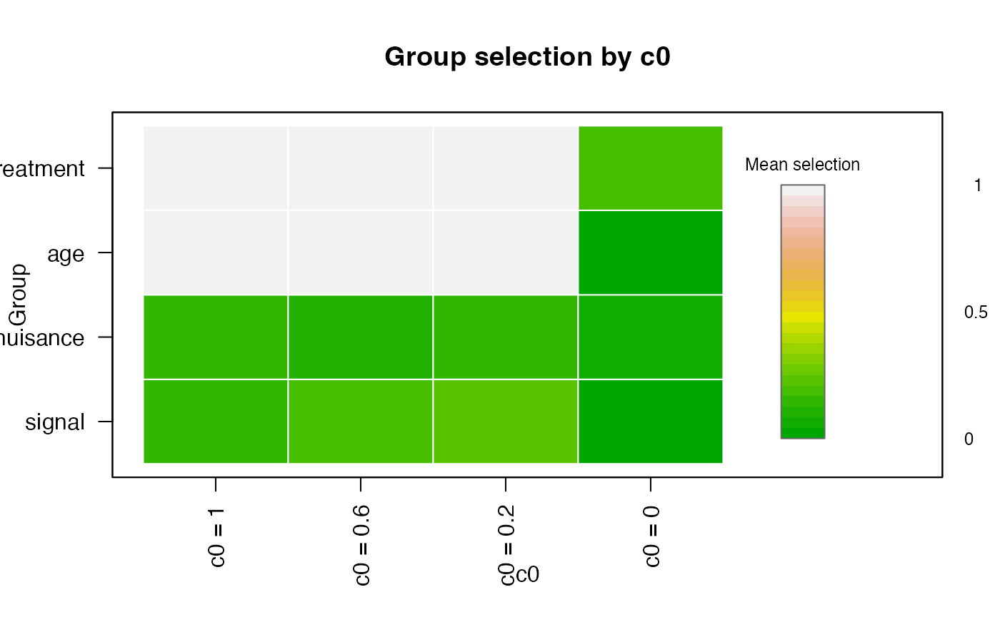

# SelectBoost for Dense Spectra

For dense spectra or finely sampled signals, `SelectBoost` is often most
useful when grouping is constrained by functional structure instead of
using a purely global correlation graph. The end-to-end workflow still
starts from raw curves and optional scalar covariates.

## Construct a spectral design object

``` r

library(SelectBoost.FDA)
data("spectra_example", package = "SelectBoost.FDA")

spectra <- fda_grid(
  spectra_example$predictors$signal,
  argvals = spectra_example$grid,
  name = "signal",
  unit = "nm"
)
nuisance <- fda_grid(
  spectra_example$predictors$nuisance,
  argvals = spectra_example$grid,
  name = "nuisance",
  unit = "nm"
)

design <- fda_design(
  response = spectra_example$response,
  predictors = list(signal = spectra, nuisance = nuisance),
  scalar_covariates = spectra_example$scalar_covariates,
  scalar_transform = fda_standardize(),
  family = "gaussian"
)

head(selection_map(design))
#>           feature predictor  block position           argval representation
#> signal.1 signal_1    signal signal        1             1100           grid
#> signal.2 signal_2    signal signal        2 1135.89743589744           grid
#> signal.3 signal_3    signal signal        3 1171.79487179487           grid
#> signal.4 signal_4    signal signal        4 1207.69230769231           grid
#> signal.5 signal_5    signal signal        5 1243.58974358974           grid
#> signal.6 signal_6    signal signal        6 1279.48717948718           grid
#>          basis_type transform source_predictor source_representation
#> signal.1       <NA>  identity           signal                  grid
#> signal.2       <NA>  identity           signal                  grid
#> signal.3       <NA>  identity           signal                  grid
#> signal.4       <NA>  identity           signal                  grid
#> signal.5       <NA>  identity           signal                  grid
#> signal.6       <NA>  identity           signal                  grid
#>          source_position_start source_position_end source_argval_start
#> signal.1                     1                   1                1100
#> signal.2                     2                   2    1135.89743589744
#> signal.3                     3                   3    1171.79487179487
#> signal.4                     4                   4    1207.69230769231
#> signal.5                     5                   5    1243.58974358974
#> signal.6                     6                   6    1279.48717948718
#>          source_argval_end     domain_start       domain_end component unit
#> signal.1              1100             1100             1100      <NA>   nm
#> signal.2  1135.89743589744 1135.89743589744 1135.89743589744      <NA>   nm
#> signal.3  1171.79487179487 1171.79487179487 1171.79487179487      <NA>   nm
#> signal.4  1207.69230769231 1207.69230769231 1207.69230769231      <NA>   nm
#> signal.5  1243.58974358974 1243.58974358974 1243.58974358974      <NA>   nm
#> signal.6  1279.48717948718 1279.48717948718 1279.48717948718      <NA>   nm
#>          feature_index basis_component        domain_label
#> signal.1             1            <NA>             1100 nm
#> signal.2             2            <NA> 1135.89743589744 nm
#> signal.3             3            <NA> 1171.79487179487 nm
#> signal.4             4            <NA> 1207.69230769231 nm
#> signal.5             5            <NA> 1243.58974358974 nm
#> signal.6             6            <NA> 1279.48717948718 nm
```

## Fit FDA-aware SelectBoost

The fitting chunk below is evaluated only when `glmnet` is installed.

``` r

sb_fit <- fit_selectboost(
  design,
  selector = "glmnet",
  selector_args = list(lambda_rule = "lambda.min"),
  mode = "fast",
  group_method = "threshold",
  bandwidth = 3,
  steps.seq = c(0.6, 0.2),
  B = 10,
  seed = 1
)

sb_fit
#> FDA SelectBoost result
#>   family: gaussian 
#>   mode: fast 
#>   features: 82 
#>   groups: 4 
#>   c0 values: 4
summary(sb_fit)
#> FDA SelectBoost summary
#>   family: gaussian 
#>   predictors: 4 
#>   mode: fast 
#>   features: 82 
#>   groups: 4 
#>   c0 values: 4
head(selection_map(sb_fit, c0 = colnames(sb_fit$feature_selection)[1]))
#>           feature predictor  block position           argval representation
#> signal.1 signal_1    signal signal        1             1100           grid
#> signal.2 signal_2    signal signal        2 1135.89743589744           grid
#> signal.3 signal_3    signal signal        3 1171.79487179487           grid
#> signal.4 signal_4    signal signal        4 1207.69230769231           grid
#> signal.5 signal_5    signal signal        5 1243.58974358974           grid
#> signal.6 signal_6    signal signal        6 1279.48717948718           grid
#>          basis_type transform source_predictor source_representation
#> signal.1       <NA>  identity           signal                  grid
#> signal.2       <NA>  identity           signal                  grid
#> signal.3       <NA>  identity           signal                  grid
#> signal.4       <NA>  identity           signal                  grid
#> signal.5       <NA>  identity           signal                  grid
#> signal.6       <NA>  identity           signal                  grid
#>          source_position_start source_position_end source_argval_start
#> signal.1                     1                   1                1100
#> signal.2                     2                   2    1135.89743589744
#> signal.3                     3                   3    1171.79487179487
#> signal.4                     4                   4    1207.69230769231
#> signal.5                     5                   5    1243.58974358974
#> signal.6                     6                   6    1279.48717948718
#>          source_argval_end     domain_start       domain_end component unit
#> signal.1              1100             1100             1100      <NA>   nm
#> signal.2  1135.89743589744 1135.89743589744 1135.89743589744      <NA>   nm
#> signal.3  1171.79487179487 1171.79487179487 1171.79487179487      <NA>   nm
#> signal.4  1207.69230769231 1207.69230769231 1207.69230769231      <NA>   nm
#> signal.5  1243.58974358974 1243.58974358974 1243.58974358974      <NA>   nm
#> signal.6  1279.48717948718 1279.48717948718 1279.48717948718      <NA>   nm
#>          feature_index basis_component        domain_label selection     c0
#> signal.1             1            <NA>             1100 nm       0.0 c0 = 1
#> signal.2             2            <NA> 1135.89743589744 nm       0.0 c0 = 1
#> signal.3             3            <NA> 1171.79487179487 nm       0.0 c0 = 1
#> signal.4             4            <NA> 1207.69230769231 nm       0.0 c0 = 1
#> signal.5             5            <NA> 1243.58974358974 nm       0.2 c0 = 1
#> signal.6             6            <NA> 1279.48717948718 nm       0.0 c0 = 1
#>          group_id  group
#> signal.1        1 signal
#> signal.2        1 signal
#> signal.3        1 signal
#> signal.4        1 signal
#> signal.5        1 signal
#> signal.6        1 signal
selected(sb_fit, level = "group", c0 = colnames(sb_fit$feature_selection)[1])
#>   predictor group_id     group representation basis_type source_representation
#> 1    signal        1    signal           grid                             grid
#> 2  nuisance        2  nuisance           grid                             grid
#> 3       age        3       age         scalar                           scalar
#> 4 treatment        4 treatment         scalar                           scalar
#>   n_features start_position end_position start_argval end_argval domain_start
#> 1         40              1           40         1100       2500         1100
#> 2         40              1           40         1100       2500         1100
#> 3          1              1            1          age        age          age
#> 4          1              1            1    treatment  treatment    treatment
#>   domain_end     c0 mean_selection max_selection selected_features
#> 1       2500 c0 = 1         0.1650             1                 9
#> 2       2500 c0 = 1         0.1375             1                 9
#> 3        age c0 = 1         1.0000             1                 1
#> 4  treatment c0 = 1         1.0000             1                 1
plot(
  sb_fit,
  type = "group",
  value = "mean",
  legend_title = "Mean selection",
  palette = grDevices::terrain.colors(24)
)
```



The
[`selection_map()`](https://fbertran.github.io/SelectBoost.FDA/reference/selection_map.md)
method keeps the wavelength information attached to each coefficient,
which is the main advantage of moving from raw matrices to FDA-native
design objects.
